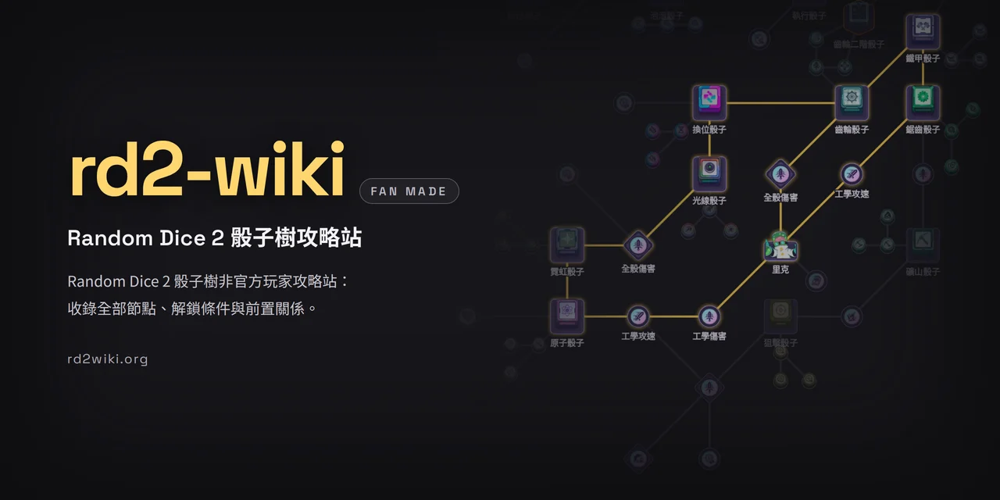
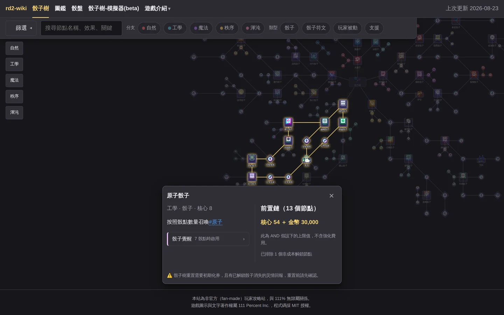
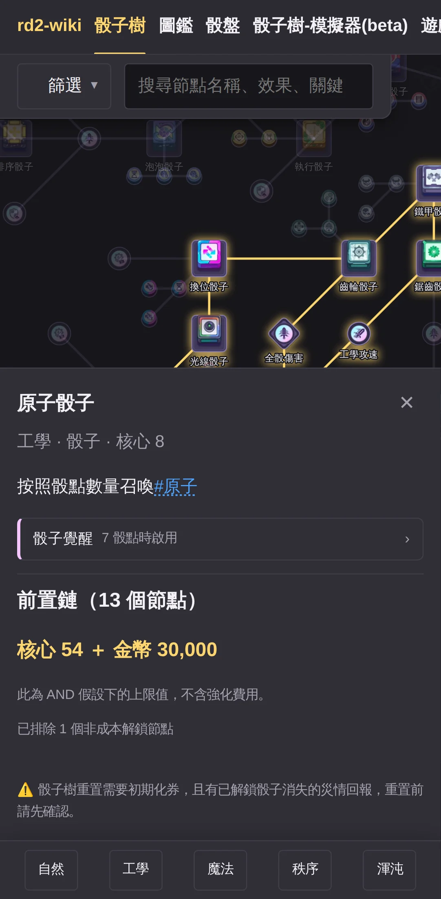

<p align="center">
  
</p>

<h1 align="center">rd2-wiki</h1>

<p align="center">《Random Dice 2》骰子樹非官方玩家攻略站：收錄全部節點、解鎖條件與前置關係。</p>

<p align="center">
  [<a href="https://rd2-wiki.pages.dev/">開啟網站</a>]
  [<a href="https://rd2-wiki.pages.dev/tree/">骰子樹</a>]
  [<a href="./CONTRIBUTING.md">貢獻指南</a>]
  [<a href="https://rd2-wiki.pages.dev/about/">關於</a>]
</p>

<p align="center">
  <a href="https://rd2-wiki.pages.dev/tree/"></a>
</p>

<p align="center">
  <a href="./LICENSE"></a>
  <a href="./data/NOTICE.md"></a>
</p>

> [!WARNING]
> 本站是玩家自製（fan-made）的攻略站，與《Random Dice 2》開發商 111 Percent Inc. **沒有任何隸屬關係**，
> 也沒有經過官方授權或審核。站上的遊戲圖示與效果文字著作權屬 111 Percent Inc.，詳見〈[授權](#授權)〉。

## 這站在解什麼問題

骰子樹是《Random Dice 2》裡最貴的一次性投資：每個節點都要花核心或金幣解鎖，而且**被前置節點鎖住**——
你想要的那顆骰子，往往得先把路上一整串你未必想要的節點全解開。遊戲介面一次只給你看眼前那一格，
花了多少、還要花多少，得自己回頭一格一格數。

rd2-wiki 把整棵樹攤平在同一張畫布上：**點一個節點，它在樹上的所有前置會一起亮起來，
並直接算出這條路總共要花多少核心與金幣。** 解鎖之前就能比較路線，不必先花了才發現走錯邊。

<p align="center">
  
</p>

## 能做什麼

- [x] **全樹一次看完**——239 個節點（骰子、骰子符文、玩家被動、支援效果）與彼此的前置關係
- [x] **前置鏈高亮**——點一個節點，路上所有前置節點與連線一起亮起，其餘淡出
- [x] **解鎖成本試算**——列出這條前置鏈的節點數與累計核心／金幣
- [x] **搜尋與篩選**——依名稱、效果文字、關鍵字搜尋，並可依分支與節點類型篩選
- [x] **節點詳情**——解鎖花費、等級上限、1 級與滿級的成長值、效果敘述
- [x] **手機可用**——畫布支援平移縮放，詳情改以底部面板呈現
- [x] **資料版本透明**——首頁標示對應的遊戲版本、資料來源版本與更新日期

<p align="center">
  
</p>

## 資料從哪裡來

網站呈現的骰子樹資料，正本只有三處，也是唯三需要手動維護的地方：

| 正本 | 內容 |
|---|---|
| `data/nodes.json` | 239 個節點的**文字**：名稱、類型、解鎖花費、等級上限、效果敘述、骰子覺醒、管理 ID |
| `data/dice-tree.svg` | 整棵骰子樹的**幾何**：239 個節點的位置、形狀、外框色、圖示引用、顯示標籤，以及 248 條連線 |
| `data/icons/` | 對應的圖示 PNG（238 張，檔名為內容 sha256 雜湊前 12 碼） |

兩份正本以節點 id 對應，集合必須完全一致（CI 規則 19）。

其餘資料（`data/keywords.json` 效果關鍵字白名單、`data/unlock-exceptions.json` 解鎖規則例外、
`data/upgrade-cost.json` 升級花費表、`data/maxlevel-official.json` 官方滿級值）是輔助用的設定檔。

**歡迎送 PR 修正資料。** 動手前請先讀 [`CONTRIBUTING.md`](./CONTRIBUTING.md)——它同時是貢獻指南，
也是網站 [關於頁](https://rd2-wiki.pages.dev/about/) 的內容來源；裡面寫清楚了資料格式、
送 PR 前要跑的指令，以及 CI 會擋下哪些改動。

貢獻資料時只會用到這幾個指令：

| 指令 | 用途 |
|---|---|
| `npm run validate` | 跑 CI 用的同一套資料驗證規則 |
| `npm run normalize` | 把 Inkscape 等 GUI 工具重寫過的 `dice-tree.svg` 攤平回正規形式（送 PR 前必跑） |
| `npm run add-icon <path>` | 新增圖示，自動用內容雜湊命名歸檔進 `data/icons/` |

## 開發

需求：Node ≥ 24（ESM、TypeScript strict）。

```bash
npm install
npm run dev      # 先產生資料，再啟動本機開發伺服器
```

`npm run dev` 與 `npm run build` 都會先執行 `npm run build:data`，把 `data/nodes.json`、
`data/dice-tree.svg` 與 `data/icons/` 解析、合併、轉換成網站實際使用的產物：

- `src/generated/tree.json`——節點與連線的結構化資料
- `public/assets/sprite.webp`、`public/assets/icons/*.webp`——圖示資產

這些產物不進 repo（見 `.gitignore`），每次建置都會重新產生。

### 常用指令

| 指令 | 用途 |
|---|---|
| `npm run dev` | 本機開發伺服器 |
| `npm run build` | 產出 `dist/`（先跑 `build:data` 再 `astro build`） |
| `npm run typecheck` | `tsc --noEmit`，CI 的必要檢查之一 |
| `npm test` | 單元測試（Vitest；`pretest` 會自動先產生資料） |
| `npm run e2e` | 端對端測試（Playwright；`pree2e` 會自動先建置） |

第一次跑 E2E 前要先裝瀏覽器：`npx playwright install chromium`
（缺系統套件時再加 `--with-deps`）。同一台機器上開兩個工作區平行跑 E2E 時，
其中一邊用 `E2E_PORT=4399 npm run e2e`，否則兩邊會共用同一個埠上的伺服器、測到別份產物。

### 架構

Astro 5 產生的靜態頁，部署在 Cloudflare Pages；首頁的訪客計數器是一支
Pages Functions（`functions/api/hits.ts`）搭配 D1，除此之外沒有伺服器端邏輯。
骰子樹畫布是原生 SVG ＋ TypeScript，不依賴前端框架。

### CI 與部署

PR 送出後會自動跑資料驗證、正規化定點檢查、型別檢查、單元測試、建置、效能預算與端對端測試，
資料有變動時還會在 PR 底下貼一則「資料差異摘要」留言（詳見
[`CONTRIBUTING.md`](./CONTRIBUTING.md) 第 5、6 節）。

**`verify` 與 `e2e` 兩項檢查是 merge 的必要條件**：`main` 受分支規則保護、不接受直接推送，
所有變更——包含維護者自己的——都必須經過 PR 且 CI 全綠才能合併。外部貢獻者從 fork 送來的 PR
需要維護者按一下核准，CI 才會開始跑（GitHub 的預設保護機制，不是壞掉，見
[`CONTRIBUTING.md`](./CONTRIBUTING.md) 第 7 節）。

**`main` 的變更也要 CI 全綠才會上線**：`deploy` job 等 `verify` 與 `e2e` 都通過之後，
把 `verify` 驗過的那一份建置產物上傳到 Cloudflare Pages（Direct Upload）。上線的位元組就是
通過資料驗證、效能預算、單元測試與端對端測試的那一份，不是另外重建的；Cloudflare Pages 的
Git 自動建置已關閉，所以不存在「還沒過 CI 就先上線」的第二條路徑。

副作用：PR 不會有 Cloudflare 的 preview 網址（fork PR 本來就沒有）。想看視覺效果請在本機
`npm run dev`。

## 授權

- **程式碼**：[MIT License](./LICENSE)
- **`data/` 內的遊戲圖示與效果文字**：著作權屬 111 Percent Inc.，詳見
  [`data/NOTICE.md`](./data/NOTICE.md)。本站僅整理呈現遊戲內公開內容，不主張這些素材的著作權。
